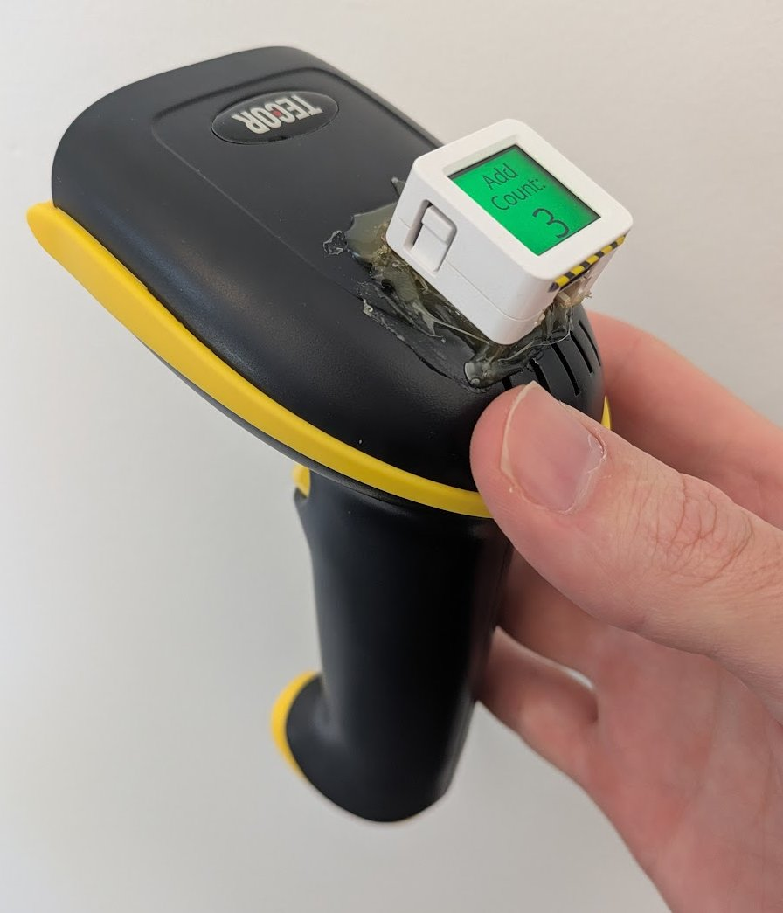
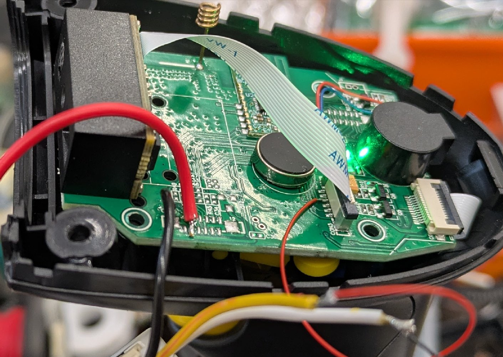
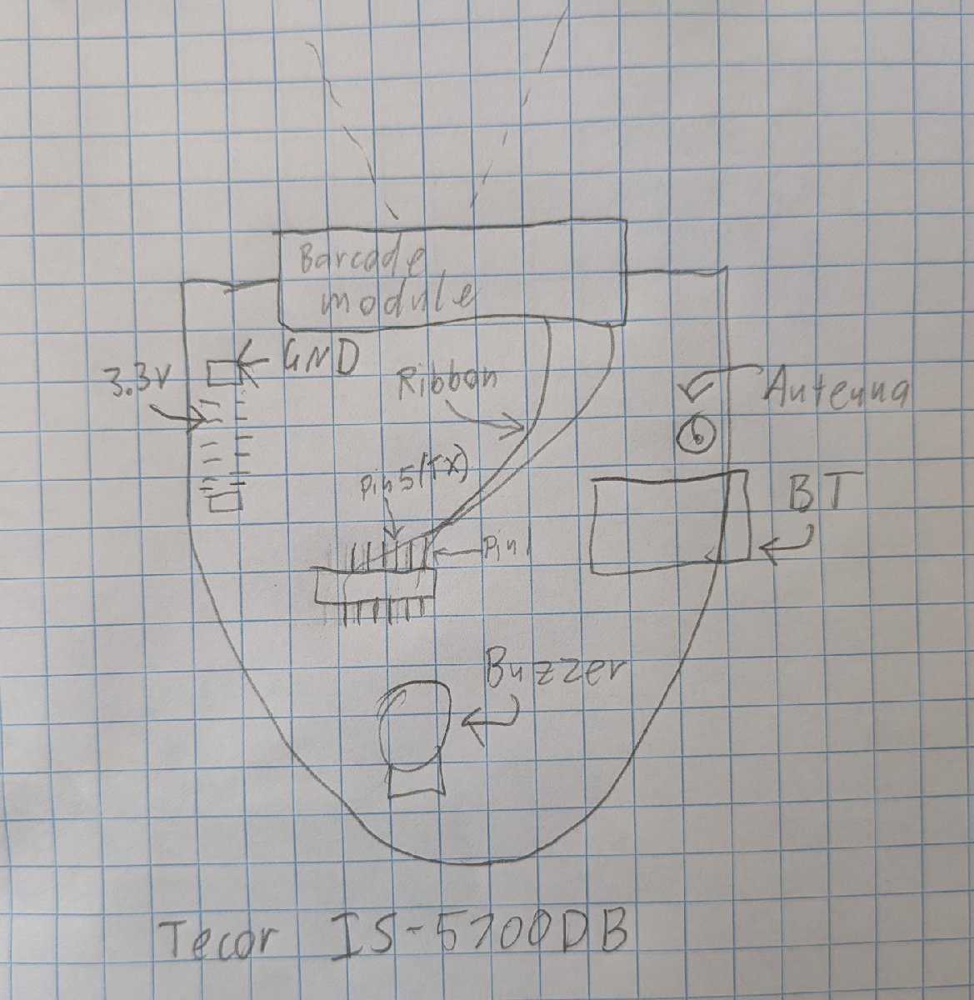
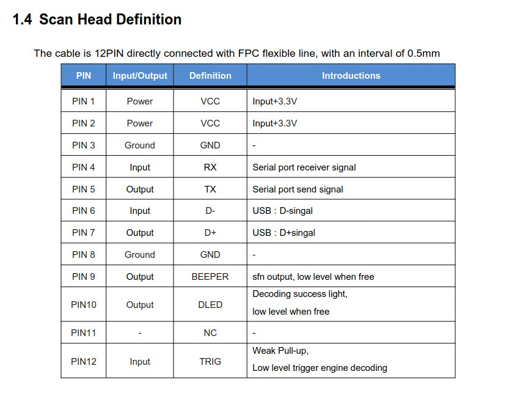

# Wireless Grocy barcode scanner

This project uses Grocy, ESPHome, an M5 AtomS3 ESP32 module and a Tecor IS-5700DB handheld barcode scanner
to help with household inventory tracking. It connects to a Grocy instance via wifi and can
add, subtract and zero the inventory count of scanned items. It also displays the current
count of the item after the operation.

This barcode scanner is based on a common GM67 barcode scanner module, so many other handheld
scanners will probably be compatible with this project. The integration of the AtomS3 is
non-destructive, so the existing functionality of the barcode scanner is preserved.

## Usage

Pull the trigger to wake the scanner and power the M3Atom. Cycle through the "Add", "Sub" or
"Zero" modes by pressing on the M3Atom screen. When in Add or Sub modes a single unit is added
or subtracted from the inventory on each scan of an item. When in Zero mode the inventory count
is set to zero when an item is scanned. Zero mode is the default.

The new item count is displayed on the screen after the count is updated on the server. If an
error occurs, or the scanned barcode is unrecognised, a question mark (?) is displayed instead
of the count.

Note that the count may have been modified even if a question mark is displayed, as it may be
the retrieve-new-item-count server request that failed.

## Videos

Overview: https://youtu.be/hvldrKMWksQ

Internals: https://youtu.be/B08wy_exyug

Improvements: https://youtu.be/t3d1Ac_AaTA

## Parts

Grocy: https://grocy.info/

ESPHome: https://esphome.io/

M5 AtomS3: https://shop.m5stack.com/products/atoms3-dev-kit-w-0-85-inch-screen

Tecor IS-5700DB: https://www.ebay.com.au/itm/363631417793

## Setup

Use ESPHome to flash the code into the AtomS3. You'll have to replace the `<snip>` bits
from the code with your own passwords/OTA keys etc. You'll have to add `grocy_url` and
`grocy_api_key` to your ESPHome `secrets.yaml`. The URL should look like
`http://192.168.1.50`, pointing at the server hosting your grocy instance. You can generate
the Grocy API key from inside the Grocy web interface.

Note that I'm connecting directly to my Grocy server using its internal IP address rather
than the web-facing `https` interface so as to avoid faffing about with TLS certificates
on the microcontroller.

Now you need to configure the GM67 module inside the barcode scanner to separate scanned
barcodes with a tab character ('\t').

    IMPORTANT NOTE!
    Some barcode scanners, including mine, have a "End Mark" configuration page in the manual.
    In my case this only affects the processing of the barcode signal between the GM67 module
    and the keyboard/bluetooth interface. We have tapped directly into the signal from the
    GM67, so we need to configure it directly.

Scanning this barcode will configure the GM67 to add the tab character to the end of the barcode:

## Physical wiring

You'll need to locate three electrical connections on the carrier board inside the scanner:

  * 3.3v power
  * Ground
  * Barcode TX

If you're pointing the scanner away from you there is an unpopulated header on the back left
of the board. You can find 3.3v power and ground here. Pick up the barcode TX from pin 5 on
on the socket for the ribbon cable on the carrier board.

The barcode module seems to be based on the GM67 ([Datasheet](https://hubtronics.in/docs/GM67-Barcode-module.pdf)).

Connect the 3.3v and ground to the corresponding pins on the back face of the AtomS3. Connect
the barcode TX to pin 8.

Mechanically attaching the AtomS3 to the barcode scanner is left as an exercise to the reader.

## Limitations and future work

  * As of 2025.5.1 there is a [bug](https://github.com/esphome/issues/issues/5949) in ESPHome's http_request that crashes when it receives a
    large response body, so I'm using a custom component that overrides the built-in http_request
    component with a fixed fork. Hopefully this workaround can be retired in the future.
  * Scans are not blocked before wifi is connected.